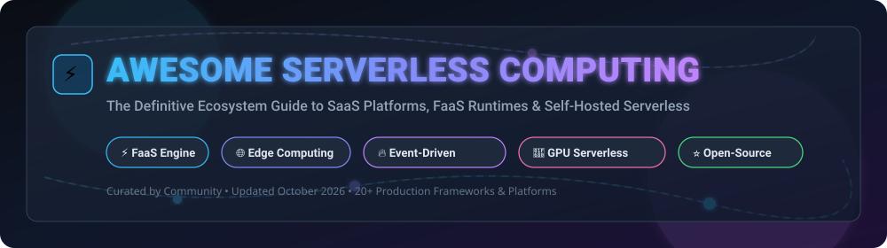

# Awesome Serverless Computing ⚡

  
  
  

## 🚀 Top Serverless Computing & Function-as-a-Service (FaaS) Ecosystem

**Curated List of Commercial SaaS Platforms, Open-Source Projects, Edge Runtimes & Serverless GPU Frameworks**

*Focused on Function-as-a-Service (FaaS), Event-Driven Architecture, Scale-to-Zero Compute, and Self-Hosted Cloud-Native Platforms.*

**Last updated: October 2026**

---

### 💡 Overview & SEO Keywords
This repository tracks notable **commercial serverless platforms** and **open-source serverless frameworks** providing Function-as-a-Service (FaaS), event-driven execution, WebAssembly edge execution, and scale-to-zero container runtimes. These technologies enable software engineers and cloud architects to run code on-demand without infrastructure management overhead.

- **Primary Topics**: `serverless`, `faas`, `cloud-computing`, `event-driven`, `awesome-list`, `kubernetes`, `edge-computing`, `gpu-serverless`.

---

## 📑 Table of Contents
- [📊 SaaS & Hosted Serverless Platforms](#-saas--hosted-serverless-platforms)
- [⭐ Open-Source GitHub Projects](#-open-source-github-projects)
- [🤝 How to Contribute](#-how-to-contribute)
- [💖 Support](#-support)
- [⚠️ Disclaimer](#-disclaimer)
- [📈 Star History](#-star-history)

---

## 📊 SaaS & Hosted Serverless Platforms

> 📈 **Market Overview & Industry Dynamics**:
> The global serverless computing market is estimated at **$16.5 Billion in 2026** and is projected to reach **$45.2 Billion by 2030**, growing at a CAGR of **22.7%**. The industry is **moderately concentrated** at the core cloud infrastructure layer among major hyperscalers (Microsoft, Google, Amazon), but remains **highly fragmented** at the developer-experience, edge-computing, and specialized AI/GPU serverless layers (Cloudflare, Vercel, Netlify, Baseten).

*Platforms are sorted by **Company Size (Revenue / Valuation)** in descending order.*

| 🏢 Product & Link | 🏛️ Parent Company | 📊 Company Size (Valuation / Revenue) | 💰 Starting Tier Price | 🎁 Free Tier / Free Trial Limits | 📝 Key Highlights & Description |
| :--- | :--- | :--- | :--- | :--- | :--- |
| **[Azure Functions](https://azure.microsoft.com/en-us/products/functions/)** ⚡ | Microsoft | **~$3.1 Trillion** (Valuation) / **$245B+** (Annual Revenue) | $0.20 per 1M executions after free tier ($0.000016/GB-s) | **1,000,000 requests/mo** + 400,000 GB-s free forever | Stateful enterprise workflows with Durable Functions & Azure Logic Apps. |
| **[Google Cloud Functions](https://cloud.google.com/functions)** ☁️ | Alphabet (Google) | **~$2.1 Trillion** (Valuation) / **$307B+** (Annual Revenue) | $0.40 per 1M invocations + $0.0000025/GB-s | **2,000,000 invocations/mo** + 400,000 GB-s free forever | Native CloudEvents support, Cloud Run backend integration, Firebase triggers. |
| **[AWS Lambda](https://aws.amazon.com/lambda/)** 🚀 | Amazon | **~$1.9 Trillion** (Valuation) / **$575B+** (Annual Revenue) | $0.20 per 1M requests + $0.00001667/GB-s | **1,000,000 requests/mo** + 3.2M sec (400k GB-s) free forever | Industry pioneer; event-driven execution with 200+ AWS service integrations. |
| **[Oracle Cloud Functions](https://www.oracle.com/cloud-native/functions/)** 🔴 | Oracle | **~$380 Billion** (Valuation) / **$53B+** (Annual Revenue) | $0.20 per 1M executions + $0.00001417/GB-s | **2,000,000 requests/mo** + 400,000 GB-s free forever | Container-native FaaS based on open-source Fn Project for OCI & hybrid cloud. |
| **[IBM Cloud Code Engine](https://www.ibm.com/cloud/code-engine)** 🟦 | IBM | **~$200 Billion** (Valuation) / **$62B+** (Annual Revenue) | $0.000009/GB-s + $0.35 per 1M HTTP requests | **100k vCPU-s** + 200k GiB-s + 100k HTTP calls/mo free forever | Unified serverless compute platform for container workloads, batch jobs & functions. |
| **[Cloudflare Workers](https://workers.cloudflare.com/)** 🌐 | Cloudflare | **~$30 Billion** (Valuation) / **$1.3B+** (Annual Revenue) | $5.00/month (Workers Paid plan incl. 10M reqs + $0.30/1M extra) | **100,000 requests/day** (~3M/mo) free forever | Edge-native V8 isolates; sub-millisecond cold starts across 300+ edge locations. |
| **[Vercel Serverless Functions](https://vercel.com/docs/functions)** 🔺 | Vercel | **~$3.25 Billion** (Valuation) | $20.00/user/month (Pro plan incl. 1M executions + $0.60/100k extra) | **100 GB-hours** (~100k executions/mo) free forever (Hobby Plan) | Frontend & Jamstack optimized FaaS with Next.js edge middleware integration. |
| **[Netlify Functions](https://www.netlify.com/products/functions/)** 🌐 | Netlify | **~$2.0 Billion** (Valuation) | $19.00/user/month (Pro plan incl. 2M requests + $25/1M extra) | **125,000 requests/mo** + 100 hrs compute time free forever | Jamstack serverless with scheduled cron background functions & edge handlers. |
| **[Fastly Compute](https://www.fastly.com/products/edge-compute)** ⚡ | Fastly | **~$1.5 Billion** (Valuation) / **$500M+** (Annual Revenue) | $50.00/month included credit ($0.50/1M reqs + $0.000002/GB-s) | **$50 free monthly credit** (~100M requests) developer account | WebAssembly (Wasm) edge platform with sub-millisecond startup times. |
| **[Baseten](https://www.baseten.co/)** 🤖 | Baseten | **~$210 Million** (Valuation) | $0.00022/second (~$0.80/hr for Nvidia T4 GPU) pay-as-you-go | **$30 free GPU compute credits** on initial sign up (Free Trial) | Serverless GPU inference platform for AI model deployment with Truss framework. |

---

## ⭐ Open-Source GitHub Projects

*Open-source serverless frameworks, scale-to-zero container platforms, and FaaS engines sorted by **GitHub Star Count** in descending order.*

| 🛠️ Repository & Link | ⭐ GitHub Stars | ⚖️ License | 📝 Summary & Capabilities |
| :--- | :--- | :--- | :--- |
| **[LocalStack](https://github.com/localstack/localstack)** |  | Apache-2.0 | Fully functional local AWS cloud stack; mock AWS Lambda, S3, DynamoDB, and Kinesis offline. |
| **[PocketBase](https://github.com/pocketbase/pocketbase)** |  | MIT | Open-source Go backend in 1 file; embedded SQLite, realtime subscriptions & event hooks. |
| **[Appwrite](https://github.com/appwrite/appwrite)** |  | BSD-3-Clause | End-to-end Backend-as-a-Service with secure serverless cloud functions in multiple languages. |
| **[OpenFaaS](https://github.com/openfaas/faas)** |  | MIT | Widely deployed developer-friendly FaaS platform; run functions as container images on Kubernetes or `faasd`. |
| **[Dapr](https://github.com/dapr/dapr)** |  | Apache-2.0 | Distributed Application Runtime providing event-driven, stateless/stateful serverless building blocks. |
| **[Fission](https://github.com/fission/fission)** |  | Apache-2.0 | Kubernetes-native FaaS with ~100ms cold starts via warm container pools; de facto open-source Lambda alternative. |
| **[BentoML](https://github.com/bentoml/BentoML)** |  | Apache-2.0 | Unified model serving framework for high-performance serverless AI & machine learning deployment. |
| **[Supabase Realtime / Edge](https://github.com/supabase/realtime)** |  | Apache-2.0 | Deno-based edge functions and realtime serverless event propagation framework. |
| **[Apache OpenWhisk](https://github.com/apache/openwhisk)** |  | Apache-2.0 | Distributed, event-driven FaaS platform engine powering enterprise scale installations. |
| **[Knative Serving](https://github.com/knative/serving)** |  | Apache-2.0 | CNCF Graduated scale-to-zero container runtime standard for Kubernetes serverless. |
| **[Nuclio](https://github.com/nuclio/nuclio)** |  | Apache-2.0 | High-performance real-time event & data-processing FaaS framework tailored for AI/ML workloads. |
| **[Tau](https://github.com/taubyte/tau)** |  | BSD-3-Clause | Git-native distributed PaaS and serverless platform; zero configuration self-hosted Cloudflare alternative. |
| **[Beta9 (Beam)](https://github.com/beam-cloud/beta9)** |  | Apache-2.0 | Sub-second cold start serverless GPU runtime for AI model inference and Modal alternative. |
| **[OpenFunction](https://github.com/openfunction/openfunction)** |  | Apache-2.0 | CNCF Sandbox cloud-native FaaS platform powered by Dapr, KEDA, and Shipwright. |
| **[Faasm](https://github.com/faasm/faasm)** |  | Apache-2.0 | High-performance stateful serverless execution engine based on WebAssembly (Wasm). |
| **[Refunc](https://github.com/refunc/refunc)** |  | Apache-2.0 | Kubernetes-native serverless platform with AWS Lambda API compatibility & AWS CLI tool support. |
| **[fn0](https://github.com/namseent/fn0)** |  | MIT | Open-source FaaS engine leveraging V8 & Wasmtime with S3-compatible document storage. |
| **[Self-Hosted Serverless](https://github.com/mstgnz/self-hosted-serverless)** |  | MIT | Lightweight Go-based serverless engine for resource-constrained edge deployments. |
| **[KubeFunction](https://github.com/KubeFunction/KubeFunction)** |  | Apache-2.0 | Kubernetes Operator for declarative CRD-driven function lifecycle management. |

---

## 🤝 How to Contribute

Contributions are highly welcomed! Please follow these simple steps:

1. **Fork** the repository.
2. Edit `README.md` to add or update relevant serverless tools.
3. Ensure entries include accurate pricing details, free tier limits, licensing, and stargazers badges.
4. Submit a **Pull Request** with a concise description of your changes.

Check out our curated list directory on [Awesome-Awesome-Awesome](https://github.com/ishandutta2007/Awesome-Awesome-Awesome)!

---

## 💖 Support

Thank you for exploring **Awesome Serverless Computing**! If you find this curated ecosystem resource useful:

- ⭐ **Star** this repository to increase visibility.
- 🍴 **Fork** it to keep your own handy reference.
- 📢 **Share** it with your engineering colleagues and cloud architecture team.
- ☕ **Sponsor / Buy me a coffee**: Support ongoing open-source maintenance via [GitHub Sponsors](https://github.com/sponsors/ishandutta2007).

---

## ⚠️ Disclaimer

- This is a **community-curated** list for informational and educational purposes.
- Serverless environments run untrusted code; always review security configurations, function isolation parameters, and data privacy policies.
- Execution metrics (cold starts, memory allocations, network latencies) vary based on region, workload density, and underlying infrastructure choices.

---

## 📈 Star History

---

  <b>Built for platform engineers, backend developers &amp; cloud architects.</b> 
  Let's keep serverless computing transparent, scalable, and open!

